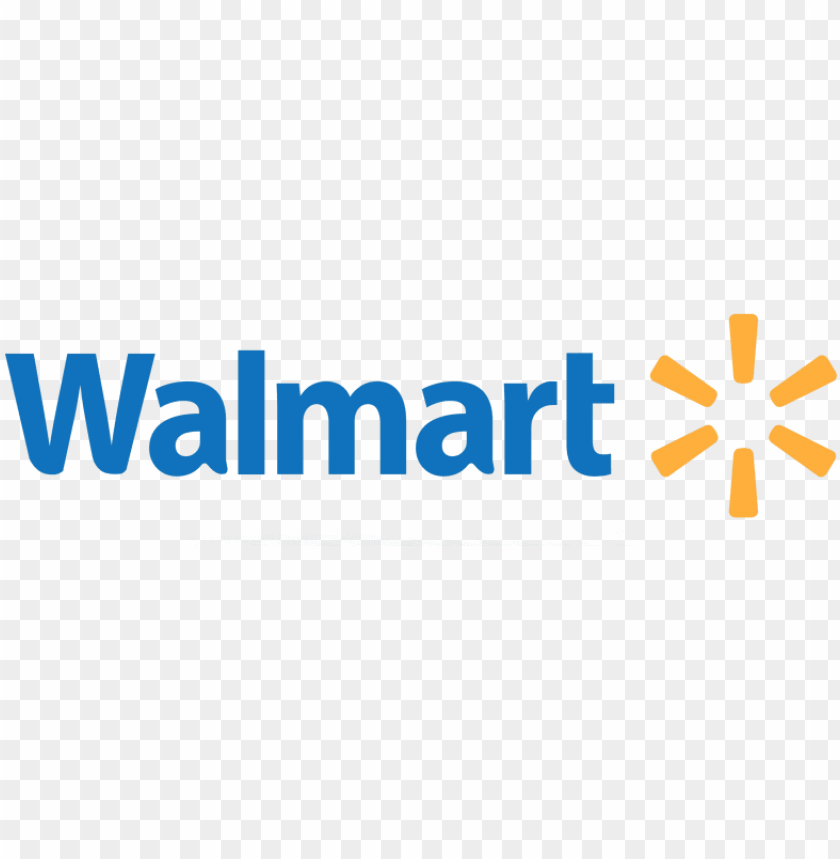
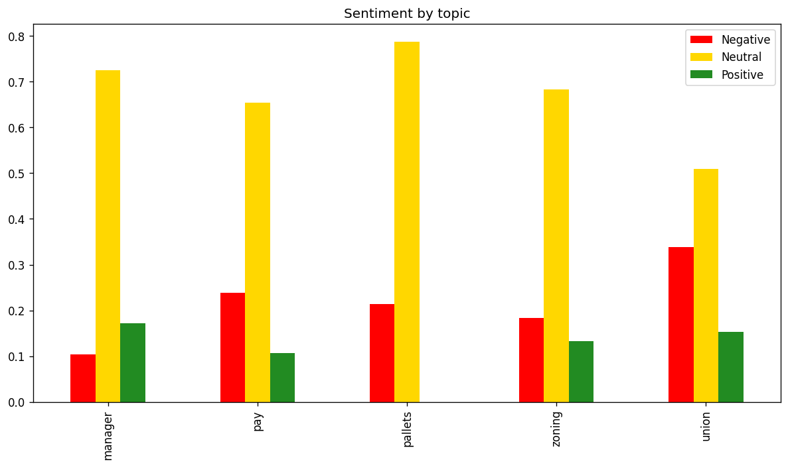

<div align="center">
  
  <h3>Walmart Social Media Sentiment Analysis Tool</h3>
  <p>
    Mine employee discussion on Reddit, find the workplace topics people are talking
    about, and measure how they feel about each one — using NLP with a lexicon tuned
    to how Walmart associates actually talk.
  </p>
</div>

Built as an undergraduate capstone project for the University of Arkansas Department of
Computer Science and Computer Engineering (2021–2022), sponsored by Walmart: a way to
gauge associate sentiment from open, anonymous discussion rather than surveys.

## How it works

1. **Collect** comments from well-received posts on a subreddit (r/walmart by default)
   via the Reddit API — or from a CSV, no credentials needed.
2. **Find topics.** Comments are matched against a curated list of workplace
   "catalysts" (pay, management, scheduling, PTO, union talk, ...) in `data.py`. Each
   author counts once per topic, so one prolific commenter can't skew the results.
3. **Score sentiment** per topic with NLTK's VADER, with one crucial twist: a custom
   lexicon for Walmart-employee vocabulary. In ordinary English "coached" is neutral —
   at Walmart it's a disciplinary action, and the lexicon scores it accordingly.
4. **Report**: a treemap of the most-mentioned topics and a per-topic sentiment chart.

<div align="center">
  
</div>

## Quick start (no credentials)

```bash
python -m venv .venv && source .venv/bin/activate
pip install -r requirements.txt
python reddit_sentiment.py --input sample_comments.csv
```

NLTK data downloads automatically on first run. Add `--save charts/` to write the
charts to files instead of opening windows.

## Live mode

Create a (free) script app at [reddit.com/prefs/apps](https://www.reddit.com/prefs/apps), then:

```bash
export REDDIT_CLIENT_ID=...
export REDDIT_CLIENT_SECRET=...
python reddit_sentiment.py --subreddit walmart --posts 25
```

Options: `--top N` (topics in the treemap), `--analyze N` (topics to sentiment-score),
`--posts N` (post limit), `--save DIR`.

## Tuning it for another community

`common_word_finder.py` surveys a subreddit (or CSV) for its most common meaningful
words — candidates for the catalyst list:

```bash
python common_word_finder.py --input sample_comments.csv --top 30
```

Then edit `data.py`: add topics to `CATALYSTS`, noise words to `BLACKLIST`, and
community-specific sentiment words to `LEXICON`.

## Tests

```bash
python -m unittest discover -s tests
```

13 offline tests cover topic matching (case/punctuation, per-author dedupe), sentiment
scoring (lexicon overrides, negation handling, emoji safety), CSV loading, and the CLI
end-to-end.

## Project structure

```
reddit_sentiment.py    # main tool: collect -> find topics -> score -> visualize
common_word_finder.py  # survey a community's vocabulary when tuning data.py
data.py                # catalysts, blacklist, and the Walmart-tuned VADER lexicon
sample_comments.csv    # demo input for offline mode
tests/                 # offline test suite
images/                # logo + example output
```

## Notes on this version

The project originally also included a Twitter crawler (Tweepy + MongoDB). It was
retired: the Twitter v1.1 search API it used no longer exists, and search now requires
a paid API tier. The Reddit pipeline was reworked for current library versions
(`emoji` 2.x, modern NLTK/pandas), comment-level VADER scoring (the original scored
word-by-word, which discards negation — "not good" scored as positive), credentials
via environment variables instead of source code, and an offline CSV mode so the tool
runs and is testable without API access.

## Acknowledgments

Capstone group: [Jonathan](https://github.com/Jmont03), [Kayla](https://github.com/kaylasam),
Caleb, Tanner, Josh.

## License

University group capstone project; no formal license. Open an issue on the repository
for reuse questions.
