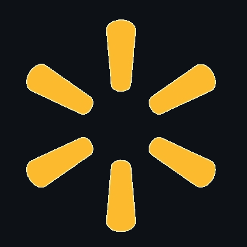

# Walmart-Capstone-Project
Undergraduate Capstone project for the University of Arkansas department of Computer Science and Computer Engineering, 2021-2022 academic year.

[![Contributors][contributors-shield]][contributors-url]
[![Forks][forks-shield]][forks-url]
[![Stargazers][stars-shield]][stars-url]
[![Issues][issues-shield]][issues-url]
[![MIT License][license-shield]][license-url]
[![LinkedIn][linkedin-shield]][linkedin-url]


<!-- PROJECT LOGO -->
<br />
<div align="center">
  <a href="https://github.com/dsalaz04/Walmart-Capstone-Project">
    
  </a>

<h3 align="center">Walmart Social Media Sentiment Analysis Tool</h3>

  <p align="center">
    We have built a tool to analyze sentiment across multiple social media platforms from Walmart associates by means of natural languge processing, machine learning, and data analysis techniques.
    <br />
    <a href="https://github.com/dsalaz04/Walmart-Capstone-Project"><strong>Explore the docs »</strong></a>
    <br />
    <br />
    <a href="https://github.com/dsalaz04/Walmart-Capstone-Project">View Demo</a>
    ·
    <a href="https://github.com/dsalaz04/Walmart-Capstone-Project/issues">Report Bug</a>
    ·
    <a href="https://github.com/dsalaz04/Walmart-Capstone-Project/issues">Request Feature</a>
  </p>
</div>


<!-- TABLE OF CONTENTS -->
<details>
  <summary>Table of Contents</summary>
  <ol>
    <li>
      <a href="#about-the-project">About The Project</a>
      <ul>
        <li><a href="#built-with">Built With</a></li>
      </ul>
    </li>
    <li>
      <a href="#getting-started">Getting Started</a>
      <ul>
        <li><a href="#prerequisites">Prerequisites</a></li>
        <li><a href="#installation">Installation</a></li>
      </ul>
    </li>
    <li><a href="#usage">Usage</a></li>
    <li><a href="#roadmap">Roadmap</a></li>
    <li><a href="#contributing">Contributing</a></li>
    <li><a href="#license">License</a></li>
    <li><a href="#contact">Contact</a></li>
    <li><a href="#acknowledgments">Acknowledgments</a></li>
  </ol>
</details>


<!-- ABOUT THE PROJECT -->
## About The Project

To better understand our associates and the way they feel about the company, We need a way to gather data on what
employees are saying about Walmart in an open-discussion environment. This tool will allow us to do so, gathering
meaningful data while maintaining anonimity across the board.

<p align="right">(<a href="#top">back to top</a>)</p>


### Built With

* [Python](https://www.python.org)
* [Javascript](https://www.javascript.com)
* [Angular](https://angular.io/)
* [Bootstrap](https://getbootstrap.com)
* [NLTK](https://www.nltk.org)
* [MongoDB](https://www.mongodb.com)
* [PyMongo](https://pymongo.readthedocs.io/en/stable/)
* [Tweepy](https://www.tweepy.org)

<p align="right">(<a href="#top">back to top</a>)</p>


<!-- GETTING STARTED -->
## Getting Started

To get started, simply follow the guide outlined below before making any changes.

### Prerequisites

The year is 2022 and some of us are still acting like PyCharm isn't the best IDE
for Python projects. I'm not upset, but rather confused. Download PyCharm if you
don't know how to run this project otherwise.

* Get the community version at [https://www.jetbrains.com/pycharm/](https://www.jetbrains.com/pycharm/)

### Installation

1. Clone the repo
   ```sh
   git clone https://github.com/dsalaz04/Walmart-Capstone-Project
   ```
2. Create and start a virtual environment to contain all packages
   ```sh
   pip install virtualenv
   cd my-project/
   virtualenv venv
   source venv/bin/activate
   ```
3. Install requirements if you haven't already
   ```sh
   pip install -r requirements.txt
   ```
4. Configure either 'Reddit_Scraper.py' or 'Tweet_Crawler.py' to be your main script
5. If using Twitter, enter your API key in `config.js`
   ```js
   const API_KEY = 'ENTER YOUR API';
   ```

<p align="right">(<a href="#top">back to top</a>)</p>


<!-- USAGE EXAMPLES -->
## Usage

Work in Progress. We will add screenshots and usage descriptions here. This will be a section for usage
based on the end user's perspective rather than the developer's perspective.

_For more in depth usage, please refer to the [Documentation](https://docs.google.com/dsalaz04)_

<p align="right">(<a href="#top">back to top</a>)</p>


<!-- ROADMAP -->
## Roadmap

- [x] Define platforms to use: Twitter, Reddit
- [x] Define tags, types of posts to look for, etc.
- [x] Build UI to interact with tool
- [ ] Extend code for higher ambiguity and resuability

See the [open issues](https://github.com/dsalaz04/Walmart-Capstone-Project/issues) for a full list of proposed features.

<p align="right">(<a href="#top">back to top</a>)</p>


<!-- CONTRIBUTING -->
## Contributing

If you would like to contribute to the project after the Spring 2022 term, feel free to do so by opening a
pull request:

1. Fork the Project
2. Create your Feature Branch (`git checkout -b feature/NewFeature`)
3. Commit your Changes (`git commit -m 'Add NewFeature'`)
4. Push to the Branch (`git push origin feature/NewFeature`)
5. Open a Pull Request

<p align="right">(<a href="#top">back to top</a>)</p>


<!-- LICENSE -->
## License

Not distributed under any license, but please contact us for reuse.

<p align="right">(<a href="#top">back to top</a>)</p>


<!-- CONTACT -->
## Contact

Daniel - [@dsalaz04](https://twitter.com/dsalaz04) - dsalaz04@gmail.com

Project Link: [https://github.com/dsalaz04/Walmart-Capstone-Project](https://github.com/dsalaz04/Walmart-Capstone-Project)

<p align="right">(<a href="#top">back to top</a>)</p>


<!-- ACKNOWLEDGMENTS -->
## Acknowledgments

* [Jonathan](https://github.com/Jmont03)
* [Kayla](https://github.com/kaylasam)
* [Caleb]()
* [Tanner]()
* [Josh]()

<p align="right">(<a href="#top">back to top</a>)</p>


<!-- MARKDOWN LINKS & IMAGES -->
<!-- https://www.markdownguide.org/basic-syntax/#reference-style-links -->
[contributors-shield]: https://img.shields.io/github/contributors/dsalaz04/Walmart-Capstone-Project.svg?style=for-the-badge
[contributors-url]: https://github.com/dsalaz04/Walmart-Capstone-Project/graphs/contributors
[forks-shield]: https://img.shields.io/github/forks/dsalaz04/Walmart-Capstone-Project.svg?style=for-the-badge
[forks-url]: https://github.com/dsalaz04/Walmart-Capstone-Project/network/members
[stars-shield]: https://img.shields.io/github/stars/dsalaz04/Walmart-Capstone-Project.svg?style=for-the-badge
[stars-url]: https://github.com/dsalaz04/Walmart-Capstone-Project/stargazers
[issues-shield]: https://img.shields.io/github/issues/dsalaz04/Walmart-Capstone-Project.svg?style=for-the-badge
[issues-url]: https://github.com/dsalaz04/Walmart-Capstone-Project/issues
[license-shield]: https://img.shields.io/github/license/dsalaz04/Walmart-Capstone-Project.svg?style=for-the-badge
[license-url]: https://github.com/dsalaz04/Walmart-Capstone-Project/blob/master/LICENSE.txt
[linkedin-shield]: https://img.shields.io/badge/-LinkedIn-black.svg?style=for-the-badge&logo=linkedin&colorB=555
[linkedin-url]: https://linkedin.com/in/dsalaz04
[product-screenshot]: images/screenshot.png
